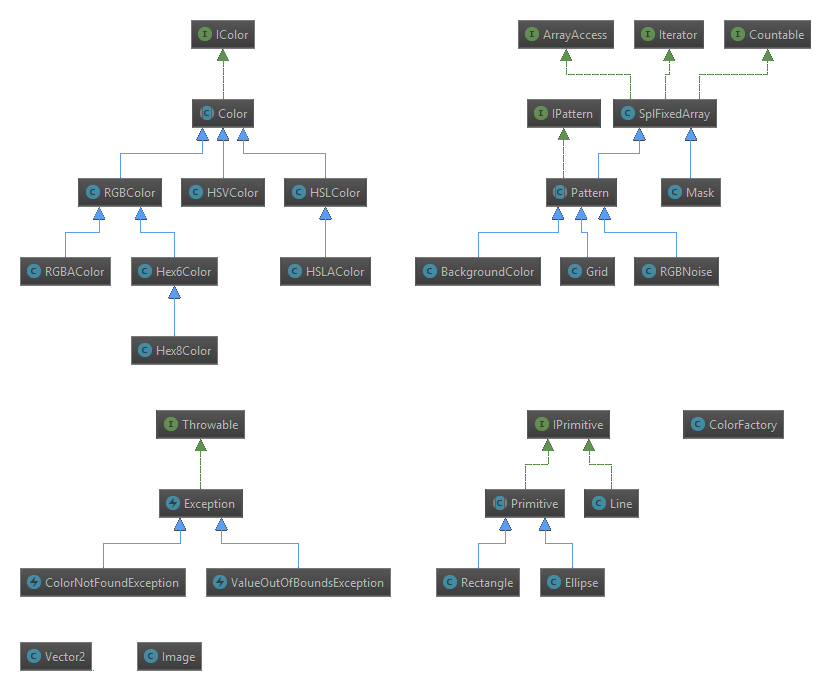

# Documentation
The various classes of Chameleon are organsised in the global `Chameleon` namespace.
Logically related classes are grouped in sub-namespaces. Be sure to `use` the classes before
you work with them:

```php
<?php
    require_once("vendor/autoload.php");

    use Chameleon\Image;

    $image = Image::create(480, 360);

    // ...
?>
```

## Namespace Hierarchy
* Chameleon
    * [Image](./Image)
    * [Mask](./Mask)
    * [Vector2](Vector2)
    * [ColorFactory](Chameleon-ColorFactory.md)
    * Colors
        * [HSLColor](Chameleon-Colors-HSLColor.md)
        * [RGBColor](Chameleon-Colors-RGBColor.md)
        * [Hex6Color](Chameleon-Colors-Hex6Color.md)
        * [Hex8Color](Chameleon-Colors-Hex8Color.md)
        * [RGBAColor](Chameleon-Colors-RGBAColor.md)
        * [HSVColor](Chameleon-Colors-HSVColor.md)
        * [HSLAColor](Chameleon-Colors-HSLAColor.md)
    * Primitives
        * [Ellipse](Chameleon-Primitives-Ellipse.md)
        * [Line](Chameleon-Primitives-Line.md)
        * [Rectangle](Chameleon-Primitives-Rectangle.md)
    * Patterns
        * [Pattern](Chameleon-Patterns-Pattern.md)
        * [BackgroundColor](Chameleon-Patterns-BackgroundColor.md)
        * [RGBNoise](Chameleon-Patterns-RGBNoise.md)
        * [Grid](Chameleon-Patterns-Grid.md)
    * Exceptions
        * [ColorNotFoundException](Chameleon-Exceptions-ColorNotFoundException.md)
        * [ValueOutOfBoundsException](Chameleon-Exceptions-ValueOutOfBoundsException.md)

## Class hierarchy diagram
