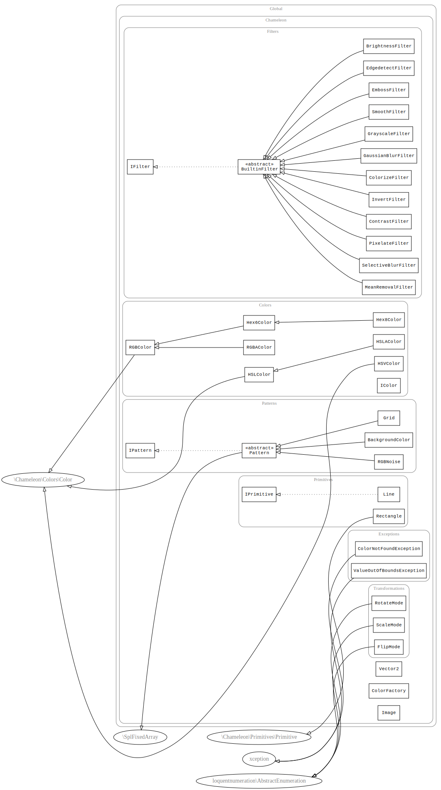

# Documentation
The various classes of Chameleon are organsised in the global `Chameleon` namespace.
Logically related classes are grouped in sub-namespaces. Be sure to `use` the classes before
you work with them:

```php
<?php
    require_once("vendor/autoload.php");

    use Chameleon\Image;

    $image = Image::create(480, 360);

    // ...
?>
```

## Namespace Hierarchy
**Warning**: Due to a bug in phpdocumentor, the documentation is incomplete (missing classes)!

* Chameleon
    * Chameleon\Colors
        * [HSLAColor](Colors/HSLAColor)
        * [RGBColor](Colors/RGBColor)
        * [RGBAColor](Colors/RGBAColor)
        * [HSLColor](Colors/HSLColor)
        * [Hex8Color](Colors/Hex8Color)
        * [Hex6Color](Colors/Hex6Color)
        * [IColor](Colors/IColor)
        * [HSVColor](Colors/HSVColor)
    * [Image](Image)
    * Chameleon\Exceptions
        * [ColorNotFoundException](Exceptions/ColorNotFoundException)
        * [ValueOutOfBoundsException](Exceptions/ValueOutOfBoundsException)
    * [Vector2](Vector2)
    * [ColorFactory](ColorFactory)
    * Chameleon\Transformations
        * [ScaleMode](Transformations/ScaleMode)
        * [FlipMode](Transformations/FlipMode)
        * [RotateMode](Transformations/RotateMode)
    * Chameleon\Primitives
        * [Line](Primitives/Line)
        * [IPrimitive](Primitives/IPrimitive)
        * [Rectangle](Primitives/Rectangle)
        * [Ellipse](Primitives/Ellipse)
    * Chameleon\Filters
        * [EmbossFilter](Filters/EmbossFilter)
        * [InvertFilter](Filters/InvertFilter)
        * [GrayscaleFilter](Filters/GrayscaleFilter)
        * [MeanRemovalFilter](Filters/MeanRemovalFilter)
        * [BrightnessFilter](Filters/BrightnessFilter)
        * [ColorizeFilter](Filters/ColorizeFilter)
        * [SelectiveBlurFilter](Filters/SelectiveBlurFilter)
        * [SmoothFilter](Filters/SmoothFilter)
        * [GaussianBlurFilter](Filters/GaussianBlurFilter)
        * [IFilter](Filters/IFilter)
        * [EdgedetectFilter](Filters/EdgedetectFilter)
        * [ContrastFilter](Filters/ContrastFilter)
        * [BuiltinFilter](Filters/BuiltinFilter)
        * [PixelateFilter](Filters/PixelateFilter)
    * Chameleon\Patterns
        * [IPattern](Patterns/IPattern)
        * [Grid](Patterns/Grid)
        * [Pattern](Patterns/Pattern)
        * [RGBNoise](Patterns/RGBNoise)
        * [BackgroundColor](Patterns/BackgroundColor)


## Class hierarchy diagram
**Warning**: Due to a bug in phpdocumentor, the diagram is incorrect!

*generated using [phpdocumentor](http://phpdoc.org/)*
