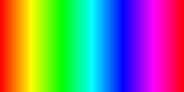

# Drawing a rainbow
## Code
```php
<?php
    require __DIR__ . "/vendor/autoload.php";

    use Chameleon\Image;
    use Chameleon\Vector2;

    use Chameleon\Colors\HSVColor;
    use Chameleon\Primitives\Line;

    $image = Image::create(360, 180);

    $lineStart = new Vector2(0, 0);
    $lineStop = new Vector2(0, 180);
    $color = new HSVColor(0, 1, 1);

    $line = new Line($lineStart, $lineStop);
    $line -> setThickness(1)
          -> setColor($color);

    for ($i = 0; $i < 360; $i++) {
        $lineStart -> setX($i);
        $lineStop -> setX($i);

        $color -> setHue($i);

        $image -> draw($line);
    }

    header("Content-type: image/png");

    $image -> as(IMG_PNG);
?>
```
## Result
