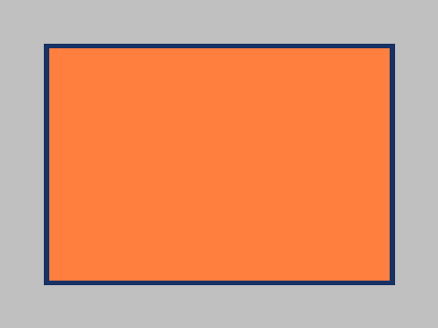

# Chameleon
Chameleon is a PHP image manipulation library built around GD.

Please note that Chameleon is still in development. Everything you see is subject to change. Existing features might be changed or removed without notice.

## Features
- Create new images from scratch or load and edit existing ones
- Multiple color systems: RGB, RGBA, 6-digit Hex, 8-digit Hex, HSL, HSLA, HSV
- Object-oriented programming interface using different Vector, Primitive and Color classes
- Different output options: PNG, JPG (planned), GIF (planned), each with base64 data-URI support (planned)

## Get started
Please note: Do not use Chameleon in production environments. It's still in development!

### 1. Install using Composer
    composer require webd97/chameleon

### 2. Set up your script
Create a new PHP file and require composer's autoloader:
```php
File: MyFirstChameleonImage.php

<?php
    require __DIR__ . "/vendor/autoload.php";
?>
```

### 3. Create a fresh image
Chameleon's image components are organized in the *Chameleon* namespace. Be sure to `use` the components you need.

```php
File: MyFirstChameleonImage.php

<?php
    require __DIR__ . "/vendor/autoload.php";

    use Chameleon\Image;

    $image = Image::create(480, 360);
?>
```

### 4. Compose your image
Create the components you like to use and set their properties.

```php
File: MyFirstChameleonImage.php

<?php
    require __DIR__ . "/vendor/autoload.php";

    use Chameleon\Image;
    use Chameleon\Vector2;

    use Chameleon\Colors\HSLColor;
    use Chameleon\Primitives\Rectangle;

    $image = Image::create(480, 360);

    $imageBackground = new HSLColor(0, 0, 0.7);

    $image -> setBackgroundColor($imageBackground);

    $rectanglePosition = new Vector2(50, 50);
    $rectangleBackground = new HSLColor(45, 1, 1);
    $rectangleBorder = new HSLColor(90, 1, 1);

    $rectangle = new Rectangle($rectanglePosition, 380, 260);
    $rectangle -> setBackgroundColor($rectangleBackground)
               -> setBorderColor($rectangleBorder)
               -> setBorderThickness(5);

    $image -> draw($rectangle);
?>
```

### 5. Output your image
You can output your image directly to the browser with just two lines of code.

```php
File: MyFirstChameleonImage.php

    (...)

    header("Content-type: image/png");
    $image -> as(IMG_PNG);
?>

```
---
That's it. Navigate your browser to MyFirstChameleonImage.php and take at look at your creation!



## Where to go next?
Take a look at the documentation (coming soon).